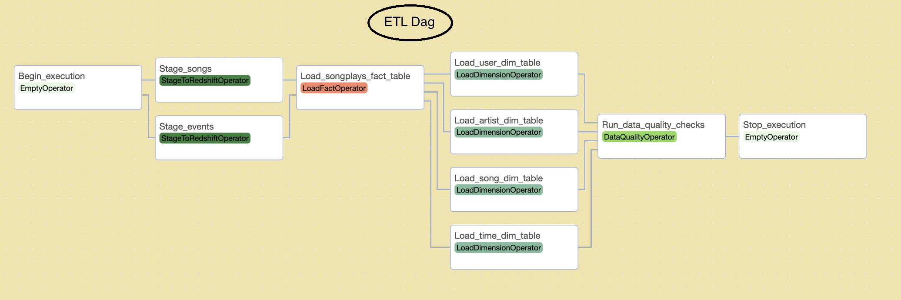

# udacity-data-engineer-nanodegree-project-04
Data Pipelines with Apache Airflow

# ETL Dag

The ETL dag is composed by the following tasks:

- Begin_execution
- Staging tasks
> Copy data from S3 to staging tables in Redshift. Stage_songs and Stage_events tasks are run in parallel.
- Load fact table task
> Load songplays fact table in Redshift
- Load dimension tables tasks
> Load dimension tables in Redshift. Load_user_dim_table, Load_artist_dim_table, Load_song_dim_table, and Load_time_dim_table tasks are run in parallel.
- Run data quality checks task
- Stop execution

 
 # Story

Sparkify, a music streaming firm, has determined that Apache Airflow is the most effective technology for implementing more automation and monitoring in their data warehouse ETL pipelines.

They have made the decision to include you in the project and are counting on you to develop excellent data pipelines that are easily backfilled, dynamic, and constructed from reusable jobs. They also want to run tests against their datasets once the ETL procedures have been completed in order to identify any differences in the datasets because they have observed that data quality is important when analysis are performed on top of the data warehouse.

S3 contains the raw data, which must be processed.
